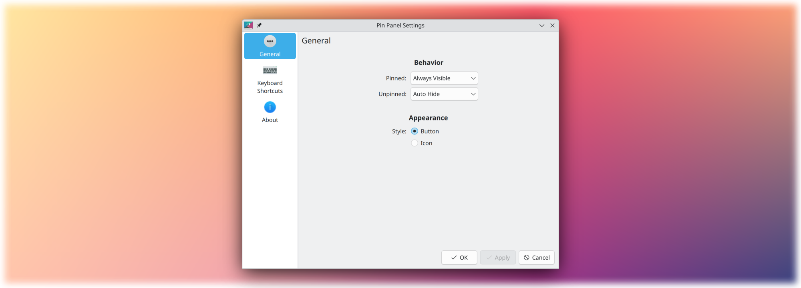

# Pin Panel

Pin/unpin a Plasma panel




## Usage

Add the applet to a panel. To configure visibility modes for the pinned/unpinned state, configure the applet. To better tune sizing, consider the usage of a margins separator.

## Installation

It is recommended to install the applet via "Get New…" or Discover, which obtain the applet [from the KDE Store](about:blank). Manual installation is only required for development and testing.

There is no compiled content, so the plasmoid can be trivially installed by copying files.

It is necesary to restart Plasma after installing:

`systemctl restart --user plasma-plasmashell.service`

### Script

```bash
./plasmoid-replace.sh
```

### CMake

```bash
git clone https://invent.kde.org/olib/pinpanel.git
cd pinpanel
cmake . && sudo make install
```

### kdesrc-build

The applet can be installed into kdesrc-build's prefix:

```bash
cmake -B build -DCMAKE_PREFIX_PATH="~/kde/usr" -DCMAKE_INSTALL_PREFIX="~/kde/usr"
cd build && make install
```

## Uninstallation

If you have installed the applet via "Get New…" or Discover, you can remove it there.

### Script

Simply remove `~/.local/share/plasma/plasmoids/org.kde.olib.pinpanel`.

### CMake

```bash
sudo make uninstall
```

There is no need to use sudo for kdesrc-build installations.
